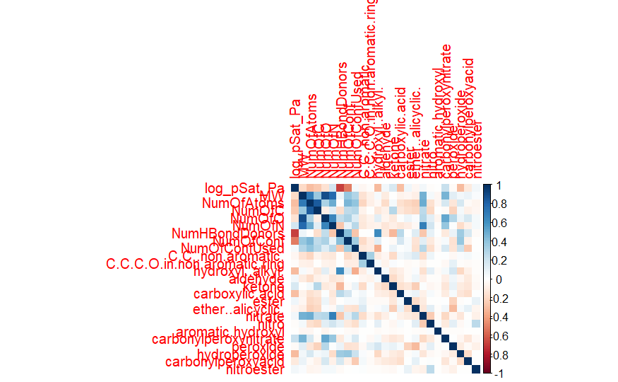

```{r setup, include=FALSE}
knitr::opts_chunk$set(echo = TRUE)
```

```{r, include=FALSE}
library(tidyverse)
library(caret)
library(pls)
library(leaps)
library(corrplot)
```

## Introduction

This document is term project initial report on course Introduction to Machine Learning Autumn 2024 at Helsinki University.

Term project was based on GeckoQ data set that had roughly 32 000 atmospherically relevant molecules with 24 variables. Our task was to predict log_pSat_Pa (response) based on other variables and post out prediction to Kaggle to enter competition. Metric in competition to evaluate models was chosen by instructors to be Rsquared.

Authors of this report are Simo Liimatta and Kim Ståhlberg. Our group number was 16.

## Data exploration

We approached this task by first looking at the data. We observed distributions of each variable and checked if there was any missing values present in the data. We did not see any missing values or anything suspicious while investigating distributions of the variables.

One other thing that we did was to plot each variable against our response. This visual inspection did not provide any further insight over the data.

Next thing we did was to model each variable against our response and inspect residual plots of each model. From these residual plots we did find variable NumOfConf to seem to have a non linear relation with response.

Next we inspected correlation matrix to see if there is any major correlation regarding our variables.


From the picture we can see that up left corner has some strong correlation going on. It makes sense since the variables there are related to number of atoms (in general and some specific atoms) and molecular weight.

## Data split

We decided to split the Kaggle training data into sub sets train and validation. Our validation was size 4 000 and rest was left for training. 

## Feature selection for linear models

Based on data exploration we tried following transformations to NumOfConf variable: exp, log and different orders of polynomials. After using these transformations in linear models log seemed to increase our score a tiny bit so we decided to keep this transformation.

Based on the correlation matrix we tried to drop some of the correlated variables and fit new linear models with subsets like that but none seemed to be better or worse than the others. There fore we decided to leave it as it is and proceed with forward and backward step wise feature selection.

With full set we got following table (number of features with Rsquared):

 [1] 0.4749909 0.6246420 0.6483377 0.6621683 0.6735196 0.6814940 0.6872278 0.6929980 0.6973873 0.6994935 0.7021541
[12] 0.7038661 0.7047161 0.7056352 0.7063017 0.7063717 0.7065238 0.7065716 0.7066148 0.7066561 0.7066734 0.7066870
[23] 0.7066932 0.7066994 0.7067018 0.7067064

Here we can see that Rsquared settles down roughly with 13 - 15 variables.

We decided to do forward and backward feature selection with 15 variables and try these sets of variables with our linear model.

## Models

We ended up trying few different models and we were using Rsquared (score) as our evaluation metric. In the following subsections we describe each model in a bit more detail.

#### Dummy

Our dummy model was just simply sample mean, in other words expected value of the response variable. This model gave us a score of roughly zero. We used this as a base line.


#### Linear with all variables

To out perform our dummy model we choose to fit a linear model with all variables included. Our score with this model was 


#### Linear with selected variables

As mentioned in feature selection section we proceeded with subsets that we got out from forward and backward feature selection. Subset from forward selection worked better with our linear model and it contained following variables:

cols_to_keep <- c("NumOfC", "NumOfN", "NumHBondDonors", "NumOfConf", "parentspecies", "C.C..non.aromatic.", "hydroxyl..alkyl.", 
                  "aldehyde", "carboxylic.acid", "ester", "ether..alicyclic.", 
                  "nitrate", "nitro", "hydroperoxide", "log_pSat_Pa")

We ended up using this prediction as our model since it scored the highest out of our model in Kaggle forum. Our score was 0.7098.

####PCR

Here we used full scaled data set (- ID and - parentspecies) and CV to figure out the score for this model.

We ended up trying PCR with 14 components since Rsquared seemed to converge with this amount of components. It scored only 0.67 on our cross validation (5 folds).

#### SVR

We tried SVR with different features. First we put the full data matrix into SVR and received score of 0.739 on validation set. 

Based on feature selection, we decided to test SVR with log-transformation on NumOfConf. This provided us with lower score than with full data set.

We decided to try SVR with the data set we got out from forward feature selection but it scored less than model with all features.

We finally made predictions with SVR trained on scaled data set that had no NumOfConf included. This was due to the fact that this variable was distributed a little differently on test set than in training set. This made a huge difference in SVR performance on Rsquared metric.

With this model we scored in Kaggle 0.7473 and this was our highest score in this competition.

#### Cluster model

We had an idea to first find out with hierarchical clustering the number of clusters in the data it gives with all 3 link functions. Then we planned to divide our full training set into subsets by k-means (with number of clusters revealed by HC) and try different models for each subset.

We may try this for the final report but we had no time to bring it here.


## Summary

As mentioned we may try this clustering idea still in the final report.

We want to describe the models a little bit in detail that we tried, especially SVR since it scored the highest so far.

And for the final report we document this whole process with more detailed pictures and prints. This report is unfortunately a little bit all over the place.

So after trying with linear models, PCR and SVR, SVR ended up being the best in this competition.
